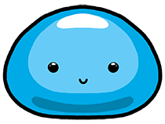
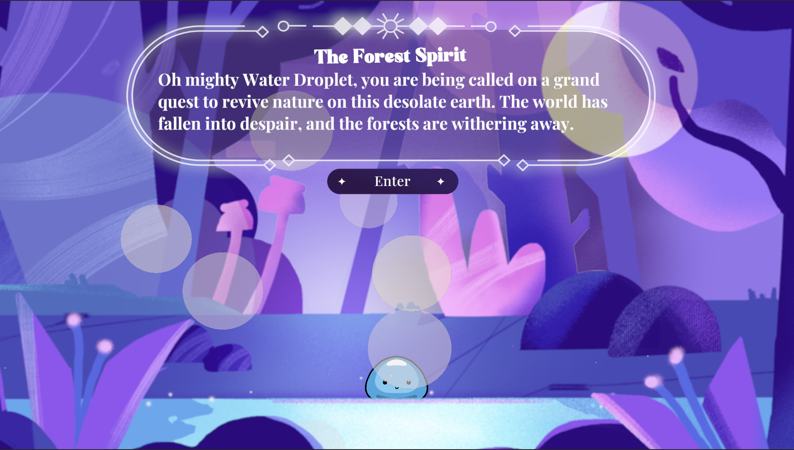
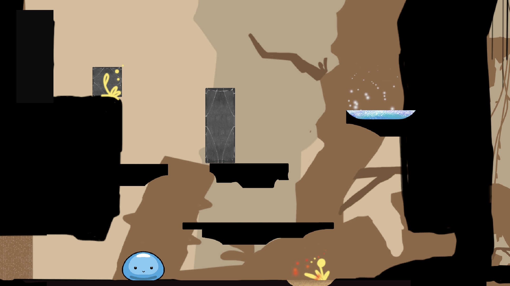
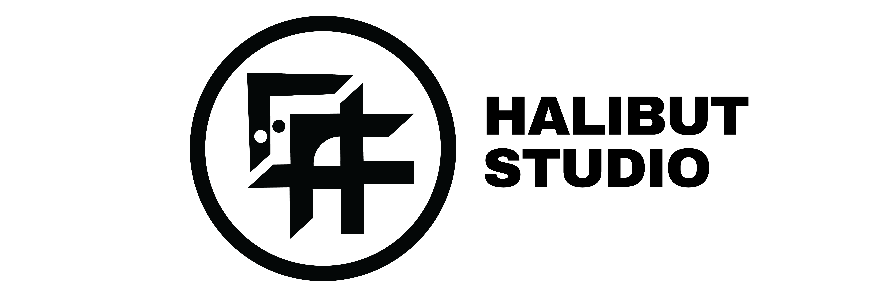

# The Last Drop of Hope
 

Embark on a quest with a water droplet called Baubi, as it journeys from a magical forest through deserts and underground caverns to revive dying forests and restore life with the power of ancient magic.  
**Please Enjoy!**

🎮 Download Here: [**The Last Drop of Hope**](https://beepboopbuchi.itch.io/the-last-drop-of-hope) 
⚠️ **For  Mac users**: if the game does not start, right click the game icon and click Open

Game Category: 🏃2D Platformer, 🧩Puzzle Solving

## Gameplay Screenshots

## Scource Code Installation
1. Download Unity Hub: [https://unity.com/download](https://unity.com/download)
2. On Unity Hub install **Unity version 2022.3.38f1**
3. Create and navigate to a directory for scource code intallation 
4. Clone this repository with the following command:   `git clone https://github.com/ruchi-ukhade/waterdroplet-game.git`
5. On Unity Hub, go to Project -> Add -> Choose the directory that you have created -> Open
6. Enjoy our game, and happy coding!

## Halibut Studio

Hi! we are Halibut Studio, the 4-person team behind the game 
**The Last Drop of Hope**.

**Team Members:**  
[Jiecheng Chen](https://github.com/JasonARong) - Lead Developer, Gameplay/Level Designer  
[Ruchi Ukhade](https://github.com/ruchi-ukhade) - Developer, Animator, Coordinator 
Xindi Lyu - Art Director, Animator, Game Gaphics Designer 
Zhiyu Zhang - Player Researcher